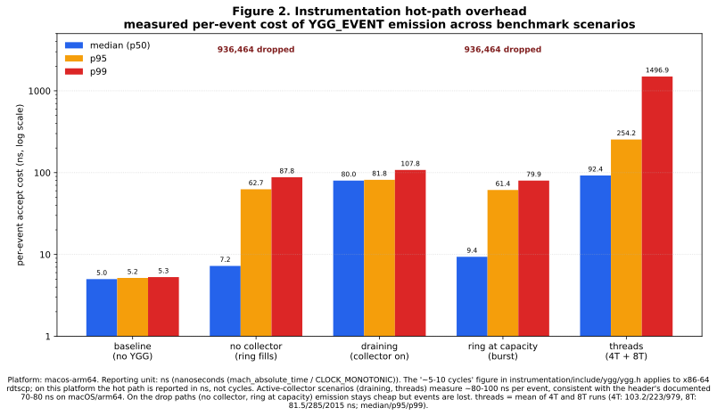
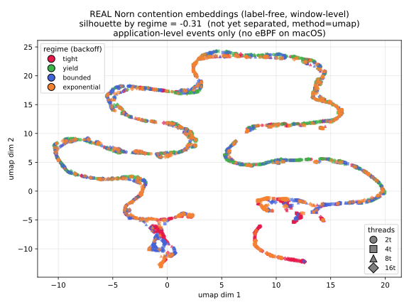
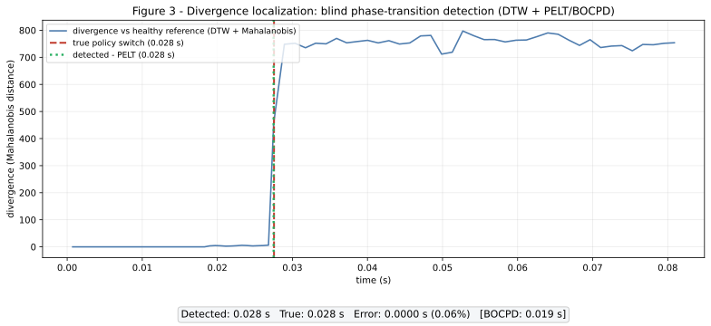

# Ygg

Turn versioned execution traces into diagnostics about where behavior changed and what a run resembles.

Ygg combines application events, Linux kernel telemetry, a versioned Arrow schema, representation learning, and change-point analysis.
Dropped-event counts stay in the data instead of disappearing from the result.

<table>
  <tr>
    <td></td>
    <td></td>
  </tr>
</table>

## What the studies say

Synthetic contention regimes separate under masked-only training.
A blind policy switch was localized close to its injected point.

Real Norn backoff regimes did not separate from application events alone across five objective variants.
That negative result points the next study toward scheduler, preemption, and migration signals from the Linux collection path.

The Rust collector compiles on macOS but does not collect kernel events there.
Linux eBPF campaigns require a compatible kernel and privileges.

[Build, capture, train, reproduce the studies, and inspect every limitation](GUIDE.md).

- [Experiment evidence](figures/README.md)
- [Architecture](docs/ARCHITECTURE.md)
- [Trace model](docs/TRACE-MODEL.md)
